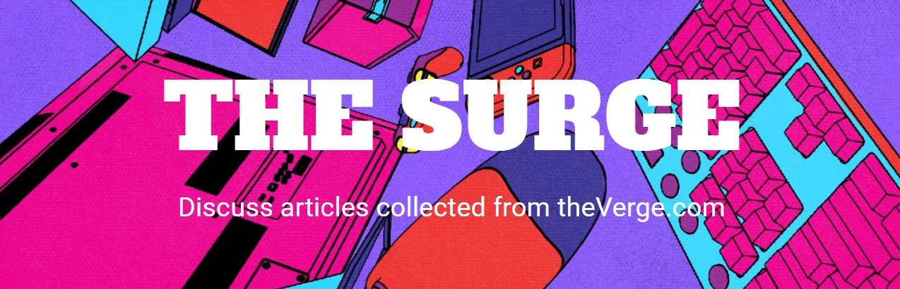
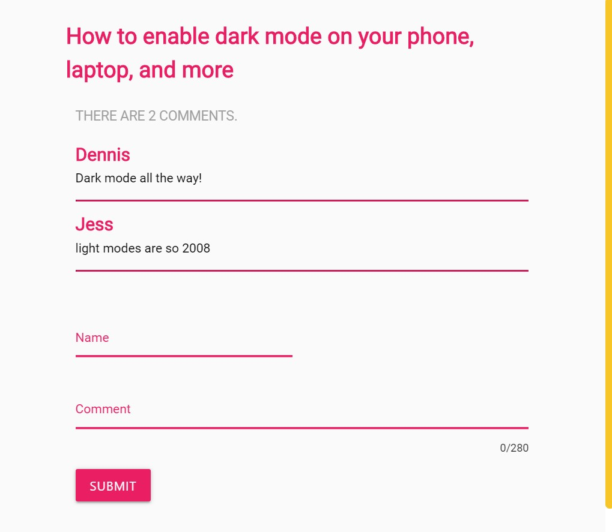

## About 

The Surge will visit theverge.com homepage behind the scenes and return with an image, link, and title of the top articles.

## Scrape and Save

After you hit the "Scrape" button you will get an organized list of articles. You can now save the articles you find most interesting.

## Discuss

On the "Saved Articles" page you will find a "Discuss" button that will allow you to leave comments for each article.

## Technologies Used

* HTML
* CSS
* Materialize 
* JavaScript
* Jquery
* Node.js
* Handlebars.js
* Express.js
* Mongoose
* Axios
* Cheerio
